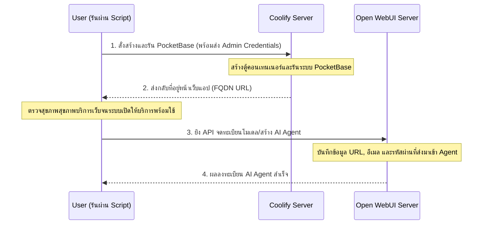

# เอกสารอธิบายการทำงาน: ระบบ Deploy อัตโนมัติและสร้าง AI Agent บน Coolify & Open WebUI

เอกสารฉบับนี้อธิบายลำดับการทำงาน (Workflow) และการทำงานร่วมกันของสคริปต์หลักในการเชื่อมโยง Coolify Infrastructure เข้ากับ Open WebUI Agent

---

## 1. ภาพรวมการทำงาน (Workflow Overview)

สคริปต์หลักที่ควบคุมการทำงานทั้งหมดคือ `deploy_integration.py` ซึ่งจะทำงานเชื่อมโยงกันเป็นแผนภาพดังนี้:



---

## 2. โครงสร้างการทำงานภายใน

สคริปต์ถูกแบ่งส่วนการทำงานเพื่อลดความซับซ้อน (Modularized) ออกเป็น 2 ส่วนชัดเจน:

### **ส่วนที่ 1: การจัดการโครงสร้างพื้นฐานบน Coolify**
*   **สคริปต์ควบคุมหลัก**: `deploy_control.py`
*   **สิ่งที่ทำ**:
    1.  ดึงการตั้งค่าจากไฟล์ `.env` เช่น Project UUID, Env Name, Server และ Destination ID
    2.  อ่านเทมเพลต `docker_compose_template.yml` และนำข้อมูลแอดมิน (`PB_ADMIN_EMAIL`, `PB_ADMIN_PASSWORD`) สอดแทรกเข้าไปในตัวแปรสภาพแวดล้อม
    3.  ส่งข้อมูล Docker Compose ขึ้นระบบ Coolify API เพื่อเริ่มสร้าง Service และนำค่า **FQDN URL** (เช่น `http://pocketbase-automation-stack.10.10.3.222.sslip.io`) กลับมาใช้งาน

### **ส่วนที่ 2: การตรวจสอบแอปและการผสานรวม AI Agent**
*   **สคริปต์ควบคุมหลัก**: `deploy_agent.py`
*   **สิ่งที่ทำ**:
    1.  ทำการตรวจสอบโดยการยิง HTTP GET ไปที่ Endpoint `/api/health` ของ FQDN URL ที่ได้มาจากส่วนแรกเป็นระยะ ๆ จนมั่นใจว่าแอปสตาร์ทสำเร็จและพร้อมใช้
    2.  ส่งข้อมูลไปหา **Open WebUI API** ผ่าน Endpoint:
        ```text
        POST {OPENWEBUI_BASE_URL}/api/v1/models/create
        ```
        โดยแนบข้อมูล Payload คอนฟิก AI Agent ให้รับรู้ URL แอดมิน และรหัสผ่านของระบบ PocketBase นั้นทันทีเพื่อเตรียมระบบทำงานอัตโนมัติ

---

## 3. รูปแบบคำสั่งที่ใช้ควบคุมการทำงาน

*   **โหมดรันชั่วคราว (Temporary Mode)**:
    ```bash
    python deploy_integration.py --mode temporary
    ```
    *รันระบบทดสอบ 5 นาทีเพื่อทำงาน/ส่งข้อมูล และมีระบบ **Safeguard** ทำลายตัวเองลบ Service ทิ้งจากระบบเมื่อครบกำหนด (หรือไม่ผ่านเกณฑ์สุขภาพ) โดยไม่กระทบ Service อื่นและเก็บ Docker Volumes ไว้*

*   **โหมดรันถาวร (Permanent Mode)**:
    ```bash
    python deploy_integration.py --mode permanent
    ```

*   **โหมดทำลาย/ถอนการติดตั้ง (Destroy Mode)**:
    ```bash
    python deploy_integration.py --mode destroy
    ```
