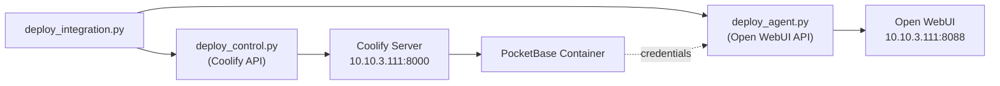
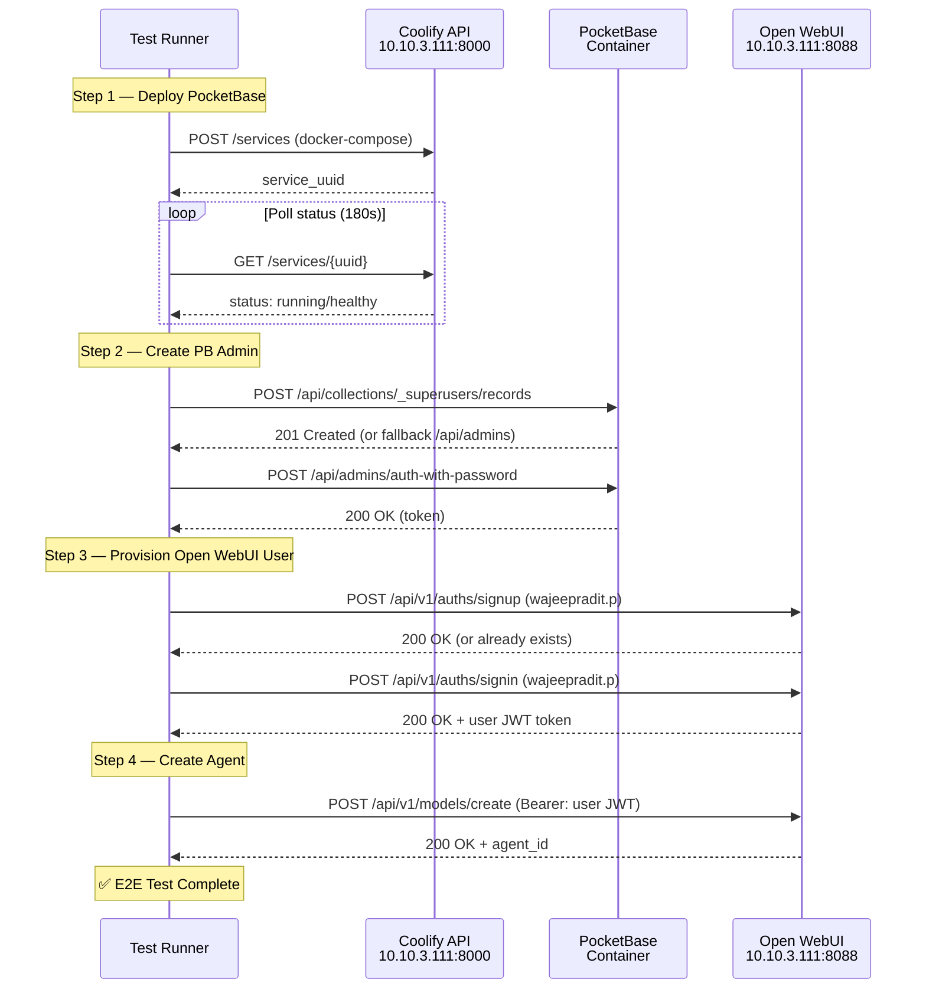
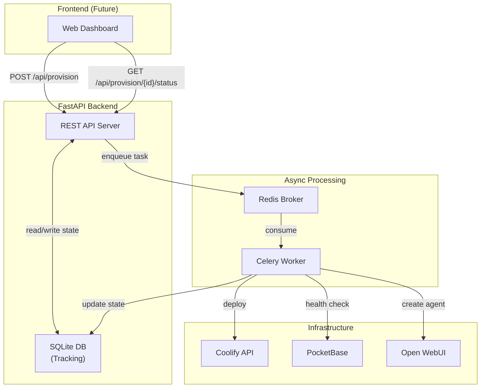
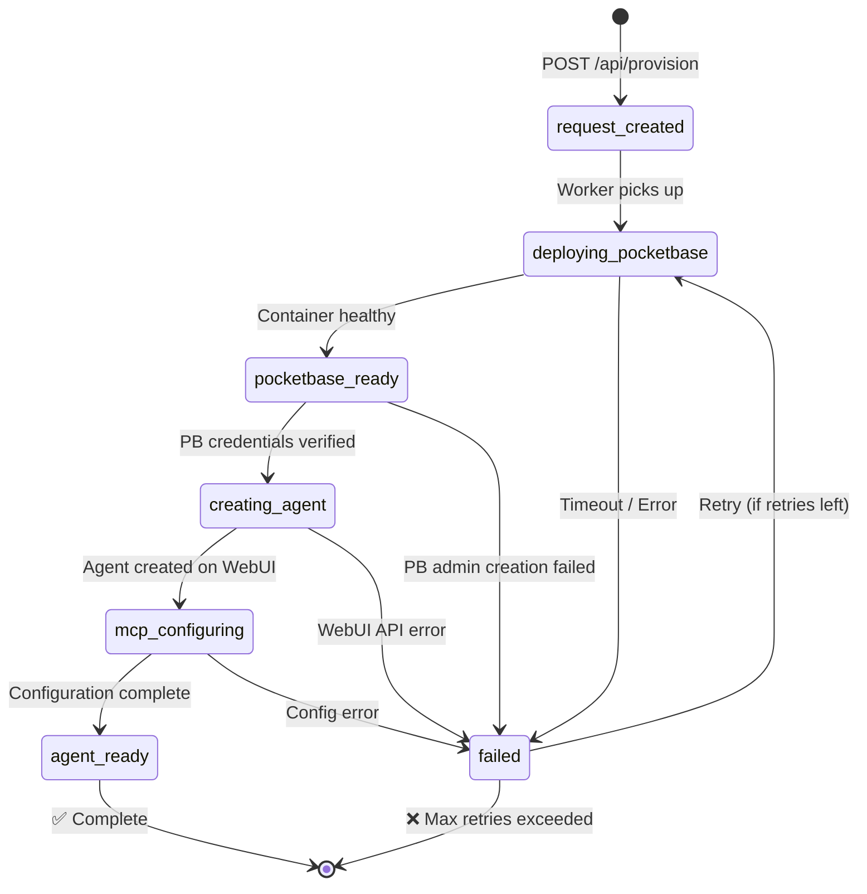
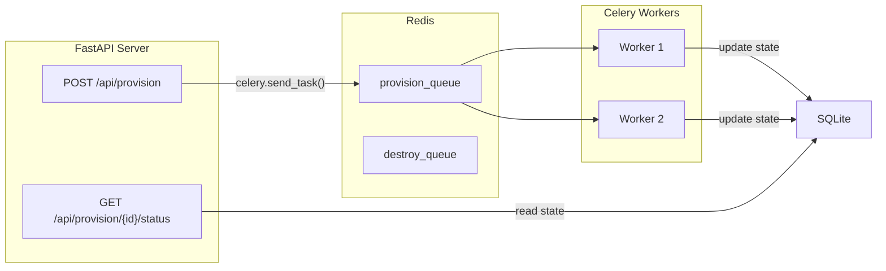

# End-to-End Deployment Test & Backend Orchestration System

## Background

ระบบปัจจุบันประกอบด้วย 3 ไฟล์หลัก:
- [`deploy_control.py`](file:///c:/Users/wajeepradit.p/git/coolify/deploy_control.py) — Deploy PocketBase Service บน Coolify + สร้าง Admin credentials
- [`deploy_agent.py`](file:///c:/Users/wajeepradit.p/git/coolify/deploy_agent.py) — ตรวจสอบ PocketBase health + สร้าง Agent บน Open WebUI
- [`deploy_integration.py`](file:///c:/Users/wajeepradit.p/git/coolify/deploy_integration.py) — Orchestrator รวม flow ทั้ง 2 เข้าด้วยกัน

### Current Architecture



### Gap Analysis

| ปัญหาที่พบ | รายละเอียด |
|---|---|
| **Agent Ownership** | ปัจจุบัน Agent ถูกสร้างด้วย fixed admin JWT token ไม่ได้ผูกกับ user เฉพาะ |
| **Open WebUI URL** | Hardcode เป็น `10.10.3.222:8088` ซึ่งไม่ตรงกับ server จริง |
| **No User Provisioning** | ไม่มี logic สร้าง/ตรวจสอบ user บน Open WebUI ก่อนสร้าง Agent |
| **No Destroy for Agent** | `--mode destroy` ลบเฉพาะ Coolify service แต่ไม่มี cleanup Agent |
| **Synchronous Only** | ทุกอย่างรันแบบ blocking ไม่รองรับ concurrent requests |
| **No State Tracking** | ไม่มี database/log เก็บสถานะ provisioning |

---

## Phase 1: End-to-End Deployment Test

### วัตถุประสงค์
ทดสอบ Full Flow ตั้งแต่ Deploy PocketBase จนถึงสร้าง Agent สำเร็จ ภายใต้ user account `wajeepradit.p@aapico.com`

### API Sequence Diagram



### Test Scenarios

#### TC-01: Happy Path — Full E2E Deployment
| Item | Detail |
|---|---|
| **Precondition** | Coolify server reachable, Open WebUI reachable, valid API tokens |
| **Steps** | 1. Deploy PocketBase → 2. Create PB admin → 3. Verify PB credentials → 4. Signup/Signin Open WebUI user → 5. Create Agent with user JWT |
| **Expected Result** | All steps succeed, Agent visible under user account |
| **Success Criteria** | PocketBase URL accessible, Admin auth returns 200, Agent ID returned from Open WebUI |

#### TC-02: PocketBase Already Exists (Clean Rebuild)
| Item | Detail |
|---|---|
| **Precondition** | Service with same name already exists on Coolify |
| **Steps** | Script detects existing service → deletes it → deploys fresh |
| **Expected Result** | Old service removed, new service deployed successfully |

#### TC-03: Open WebUI User Already Exists
| Item | Detail |
|---|---|
| **Precondition** | User `wajeepradit.p@aapico.com` already has an account on Open WebUI |
| **Steps** | Signup returns error/already exists → Signin succeeds → Create Agent |
| **Expected Result** | Gracefully handles existing user, continues to Agent creation |

#### TC-04: PocketBase Deployment Timeout
| Item | Detail |
|---|---|
| **Precondition** | Coolify server overloaded or container fails to start |
| **Steps** | Deploy → Poll for 180s → Timeout |
| **Expected Result** | TimeoutError raised, cleanup triggered |

#### TC-05: Open WebUI Unreachable
| Item | Detail |
|---|---|
| **Precondition** | Open WebUI server is down |
| **Steps** | PocketBase deploys OK → Open WebUI signup fails with ConnectionError |
| **Expected Result** | Error reported clearly, PocketBase left intact (not destroyed) |

#### TC-06: Destroy Command
| Item | Detail |
|---|---|
| **Precondition** | PocketBase service exists on Coolify |
| **Steps** | Run with `--mode destroy` |
| **Expected Result** | PocketBase service deleted, Agent on Open WebUI left untouched |

### Validation Points

| Checkpoint | Validation Method |
|---|---|
| PocketBase Service Created | `GET /services/{uuid}` returns valid response |
| Container Running | `status` field contains "running" or "healthy" |
| PB Admin Created | Auth endpoint returns 200 with token |
| PB Health Check | `GET /api/health` returns 200 |
| Open WebUI User Ready | Signin returns valid JWT |
| Agent Created | Create model returns 200/201 with `id` |

### Error Handling Scenarios

| Error | Handling Strategy |
|---|---|
| Coolify API 404 | Check project UUID exists, auto-create if missing |
| Container startup timeout | Raise TimeoutError after 180s, log error |
| PB admin registration fails | Try v0.23+ endpoint → fallback to legacy → log warning |
| Open WebUI signup fails (not "already exists") | Raise RuntimeError, PocketBase kept alive |
| Open WebUI agent creation fails | Raise RuntimeError, log full error response |
| Network timeout on any HTTP call | Retry up to 3 times with exponential backoff |

### Risk Assessment

| Risk | Impact | Mitigation |
|---|---|---|
| JWT token expired | Agent creation fails | Validate token at start; refresh mechanism |
| Coolify server disk full | Deploy fails | Pre-check server health before deploy |
| Docker image pull fails | Container never starts | Set timeout, clear error message |
| PocketBase version mismatch | Admin API endpoint differs | Try both v0.23+ and legacy endpoints |
| Open WebUI API breaking changes | Agent creation fails | Version check in health probe |

### Proposed Changes (Phase 1)

---

#### E2E Test Runner

##### [NEW] [`e2e_test.py`](file:///c:/Users/wajeepradit.p/git/coolify/e2e_test.py)

End-to-end test runner script ที่:
1. อ่าน config จาก `.env`
2. เรียก `deploy_infrastructure()` จาก `deploy_control.py`
3. เพิ่ม logic ใหม่: Open WebUI user signup/signin → ดึง user JWT
4. เรียก `verify_and_register()` จาก `deploy_agent.py` (ใช้ user JWT แทน admin token)
5. รายงานผล test ทุก step (PASS/FAIL) พร้อม timing
6. รองรับ `--mode destroy` สำหรับ cleanup

##### [MODIFY] [`deploy_agent.py`](file:///c:/Users/wajeepradit.p/git/coolify/deploy_agent.py)

- เพิ่ม function `ensure_openwebui_user()` สำหรับ signup/signin user
- แก้ `verify_and_register()` ให้รับ `openwebui_token` จากภายนอก (ที่ได้จาก user JWT)

##### [MODIFY] [`.env`](file:///c:/Users/wajeepradit.p/git/coolify/.env)

- เพิ่ม `OPENWEBUI_BASE_URL` และ `OPENWEBUI_ADMIN_TOKEN` เข้าเป็น environment variable

---

## Phase 2: Backend Orchestration & Tracking System (Design Only)

### System Architecture



### State Flow Diagram



### Database Schema

```sql
-- Provisioning Requests Table
CREATE TABLE provision_requests (
    id              TEXT PRIMARY KEY,           -- UUID v4
    user_email      TEXT NOT NULL,              -- e.g. wajeepradit.p@aapico.com
    user_name       TEXT NOT NULL,              -- e.g. wajeepradit.p
    status          TEXT NOT NULL DEFAULT 'request_created',
    -- Status enum: request_created, deploying_pocketbase, pocketbase_ready,
    --              creating_agent, mcp_configuring, agent_ready, failed

    -- Coolify Resources
    coolify_service_uuid    TEXT,
    coolify_service_name    TEXT,
    pocketbase_url          TEXT,

    -- Credentials (Fernet encrypted)
    pb_admin_email_enc      BLOB,
    pb_admin_password_enc   BLOB,

    -- Open WebUI Resources
    openwebui_user_id       TEXT,
    openwebui_agent_id      TEXT,
    openwebui_agent_name    TEXT,

    -- Retry & Error Tracking
    retry_count     INTEGER DEFAULT 0,
    max_retries     INTEGER DEFAULT 3,
    error_message   TEXT,
    last_error_at   TEXT,                       -- ISO 8601 timestamp

    -- Timestamps
    created_at      TEXT NOT NULL,              -- ISO 8601
    updated_at      TEXT NOT NULL,
    completed_at    TEXT,

    -- Celery Task
    celery_task_id  TEXT
);

-- State History Log (Audit Trail)
CREATE TABLE state_transitions (
    id              INTEGER PRIMARY KEY AUTOINCREMENT,
    request_id      TEXT NOT NULL,
    from_state      TEXT,
    to_state        TEXT NOT NULL,
    message         TEXT,
    created_at      TEXT NOT NULL,
    FOREIGN KEY (request_id) REFERENCES provision_requests(id)
);

-- System Configuration
CREATE TABLE system_config (
    key             TEXT PRIMARY KEY,
    value           TEXT NOT NULL,
    description     TEXT,
    updated_at      TEXT NOT NULL
);

-- Default config entries
INSERT INTO system_config (key, value, description, updated_at)
VALUES
    ('max_instances_per_server', '10', 'Maximum PocketBase instances per Coolify server', datetime('now')),
    ('deployment_timeout_seconds', '180', 'Max seconds to wait for container startup', datetime('now')),
    ('celery_task_timeout', '600', 'Max seconds for entire provisioning task', datetime('now'));
```

### REST API Specification

#### 1. Create Provisioning Request

```
POST /api/provision
Content-Type: application/json

{
    "user_email": "wajeepradit.p@aapico.com",
    "user_name": "wajeepradit.p"
}

Response 202 Accepted:
{
    "request_id": "a1b2c3d4-...",
    "status": "request_created",
    "message": "Provisioning request queued successfully",
    "status_url": "/api/provision/a1b2c3d4-.../status"
}
```

#### 2. Get Provisioning Status

```
GET /api/provision/{request_id}/status

Response 200 OK:
{
    "request_id": "a1b2c3d4-...",
    "status": "creating_agent",
    "user_email": "wajeepradit.p@aapico.com",
    "pocketbase_url": "http://pocketbase-wajeepradit-p.10.10.3.111.sslip.io",
    "agent_id": null,
    "progress": {
        "current_step": 4,
        "total_steps": 6,
        "steps": [
            {"name": "request_created", "status": "completed", "timestamp": "..."},
            {"name": "deploying_pocketbase", "status": "completed", "timestamp": "..."},
            {"name": "pocketbase_ready", "status": "completed", "timestamp": "..."},
            {"name": "creating_agent", "status": "in_progress", "timestamp": "..."},
            {"name": "mcp_configuring", "status": "pending"},
            {"name": "agent_ready", "status": "pending"}
        ]
    },
    "created_at": "2026-08-27T10:00:00+07:00",
    "updated_at": "2026-08-27T10:03:30+07:00"
}
```

#### 3. List All Provisioning Requests

```
GET /api/provision?user_email=wajeepradit.p@aapico.com&status=agent_ready

Response 200 OK:
{
    "items": [...],
    "total": 3,
    "page": 1,
    "page_size": 20
}
```

#### 4. Destroy Provisioned Instance

```
DELETE /api/provision/{request_id}

Response 202 Accepted:
{
    "message": "Destroy request queued",
    "request_id": "a1b2c3d4-..."
}
```

#### 5. Get System Health

```
GET /api/health

Response 200 OK:
{
    "status": "healthy",
    "coolify_reachable": true,
    "openwebui_reachable": true,
    "redis_connected": true,
    "active_workers": 2,
    "active_instances": 7,
    "max_instances": 10
}
```

### Queue/Worker Architecture



**Celery Task Chain:**
```python
# Pseudo-code for the Celery task
@celery.task(bind=True, max_retries=3, default_retry_delay=30)
def provision_pipeline(self, request_id: str):
    """
    Task chain:
    1. deploy_pocketbase (2-3 min)
    2. create_pb_admin (10s)
    3. verify_pb_health (15s)
    4. ensure_webui_user (5s)
    5. create_agent (5s)
    6. configure_mcp (5s)
    """
    update_state(request_id, "deploying_pocketbase")
    try:
        pb_url = deploy_infrastructure(...)
        update_state(request_id, "pocketbase_ready", pb_url=pb_url)
        
        user_jwt = ensure_openwebui_user(email, password)
        update_state(request_id, "creating_agent")
        
        agent = create_agent(pb_url, pb_creds, user_jwt)
        update_state(request_id, "mcp_configuring")
        
        configure_mcp(agent, pb_url)
        update_state(request_id, "agent_ready")
    except Exception as exc:
        update_state(request_id, "failed", error=str(exc))
        raise self.retry(exc=exc)
```

### Recommendations สำหรับ Production

> [!IMPORTANT]
> 1. **Secret Management** — ใช้ Fernet key จาก environment variable ไม่ hardcode ใน source
> 2. **Rate Limiting** — จำกัด provision request ต่อ user ต่อชั่วโมง
> 3. **Health Monitoring** — ใช้ Celery Flower dashboard สำหรับ monitor workers

> [!WARNING]
> 1. **JWT Token Expiry** — Open WebUI JWT tokens มี expiry date ต้องมี refresh logic
> 2. **Coolify Server Capacity** — ต้อง monitor disk/memory ก่อน provision instance ใหม่
> 3. **Docker Image Cache** — First deploy จะช้ากว่าปกติเพราะต้อง pull image

### Implementation Roadmap

| Step | Phase | Task | Duration |
|------|-------|------|----------|
| 1 | **Phase 1** | สร้าง `e2e_test.py` test runner + Open WebUI user provisioning logic | ตอนนี้ |
| 2 | **Phase 1** | แก้ไข `deploy_agent.py` ให้รองรับ user JWT | ตอนนี้ |
| 3 | **Phase 1** | รันทดสอบ E2E จริงกับ server ใหม่ | ตอนนี้ |
| 4 | **Phase 1** | สรุปผล test results + fix issues | ตอนนี้ |
| 5 | **Phase 2** | Setup FastAPI project structure | สัปดาห์หน้า |
| 6 | **Phase 2** | Implement SQLite schema + Fernet encryption | สัปดาห์หน้า |
| 7 | **Phase 2** | สร้าง REST API endpoints | สัปดาห์หน้า |
| 8 | **Phase 2** | Setup Redis + Celery workers | สัปดาห์หน้า |
| 9 | **Phase 2** | Migrate existing deploy logic เข้า Celery tasks | สัปดาห์ถัดไป |
| 10 | **Phase 2** | Integration testing + Flower monitoring | สัปดาห์ถัดไป |
| 11 | **Phase 2** | Frontend dashboard (optional) | อนาคต |

---

## Verification Plan

### Phase 1 — Automated Tests
```bash
# Run E2E test (deploy + create agent)
python e2e_test.py --mode permanent --user-email wajeepradit.p@aapico.com --user-name wajeepradit.p

# Destroy test resources
python e2e_test.py --mode destroy
```

### Phase 1 — Manual Verification
- เปิด PocketBase Admin UI ที่ URL ที่ได้
- Login ด้วย credentials ที่สร้างขึ้น
- เปิด Open WebUI → ตรวจสอบว่า Agent ปรากฏภายใต้ user account

### Phase 2 — Manual Verification
- ทดสอบ API endpoints ผ่าน Postman/curl
- ตรวจสอบ state transitions ใน database
- Monitor Celery workers ผ่าน Flower dashboard
